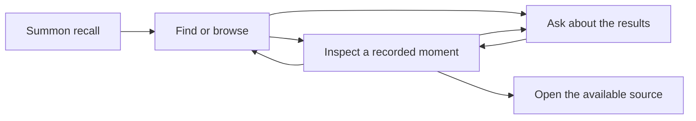

# Omarchy recall: interaction proposal

Started: 2026-09-17. Updated: 2026-09-18. Status: UX direction endorsed; detailed behavior remains a proposal, not an approved implementation.

This develops the [living exploration](omarchy-agent-exploration.md). The user chose the original Rewind desktop experience as the interaction reference. Current scope is Omarchy desktop, screen memory, local storage with optional user-configured S3-compatible offloading, configurable retention, and reasoning through an already configured coding agent. The user endorsed the UX direction on 2026-09-18 and reinforced keyboard-driven operation.

## Design premise

One connected recall experience: summon it, find something, recognize the recorded moment, explore nearby context, then ask about it or return to the source. Visual evidence occupies most of the space. Agent answers remain connected to that evidence.

The user arrives with an incomplete recollection while doing other work. Success means recognizing the right material and continuing with it, without first remembering which application or project contained it. The interface operates as a desktop utility; opening and dismissing it should preserve the user's working position.

**Clarification, 2026-09-18:** searching what appeared on screen and returning to the matching point on the timeline is the core experience. The prior draft overstated automatic conversation/project association as a feasibility requirement. That is optional assistance. Omakase is only the user's example of a remembered term, not a dependency, integration, or subsystem. No off-screen activity log is required for these stories.

## Historical evidence reviewed

The original [Rewind Demo](https://www.youtube.com/watch?v=dIV0ZiZluQo) was successfully opened in the browser on 2026-09-17. Selected frames were visually inspected; this is not an exhaustive review of every product version.

| Reference | Directly observed |
| --- | --- |
| [About 0:27](https://www.youtube.com/watch?v=dIV0ZiZluQo&t=27s) | A floating search field over recorded desktop content; a bottom timeline with app icons, colored spans, a central playhead, and relative-time label. |
| [About 0:51–1:04](https://www.youtube.com/watch?v=dIV0ZiZluQo&t=51s) | Search field above app filters and a grid of large previews. Matching text is highlighted; results have app/title/time context. Some expose an Open in Chrome action. |
| [About 1:30](https://www.youtube.com/watch?v=dIV0ZiZluQo&t=90s) | Selected recorded content enlarged, meeting transcript beside it, timeline and timestamp below, search query and Back retained. |
| [About 1:43](https://www.youtube.com/watch?v=dIV0ZiZluQo&t=103s) | Recorded desktop context changes while the query remains visible; browser reopening, starring, and timeline controls remain accessible. |

A [2024 Ask Rewind screenshot](https://media.wired.com/photos/6658f3d0c5216ae5f8728030/master/w_1600%2Cc_limit/03-macos.jpg), credited to David Nield in [WIRED](https://www.wired.com/story/microsoft-recall-alternatives/), was also visually inspected. It shows a separate conversation window, answer text with numbered source links, and a bottom composer. The founder's [published demo transcript](https://www.linkedin.com/posts/dsiroker_what-if-you-had-perfect-memory-what-if-you-activity-7047770176154456065-vHqc) describes those links opening local recorded evidence.

The proposal below connects these functions within one Omarchy surface. That integration is our proposal, not a claim that the original Rewind had this exact layout. The historical meeting transcript is evidence for a layout pattern; audio remains outside our initial scope.

## The proposed experience



### 1. Summon

A global shortcut or bar action opens a compact native overlay on the current monitor, with focus in one input. The empty view offers recent recorded moments and a route into the timeline. Capture status and pause are easy to reach but visually secondary to recall.

The same input accepts fragments or full sentences. **Find** searches retained history and shows visual results; **Ask** explicitly submits a question to the configured agent. Find is the default. This keeps local browsing useful without a model and avoids sending every keystroke to a provider. There is no need to start a separate conversation to use Ask.

Opening from a particular editor or workspace does not silently constrain historical search to that project. Any active time/app/project scope is visible and removable.

### 2. Find and recognize

The compact entry expands into a large recall surface on the same monitor. Keep the query at the top, optional app/date filters beneath it, and generous screenshot previews in the main area. Each result exposes the matching region, a short readable excerpt, source identity where known, and observation time.

Group repetitive frames into recognizable moments while retaining access to individual observations. Results can be examined as they become available; an agent summary must not delay their appearance. Relevance is the default ordering, with chronological browsing available through the timeline. Filters narrow results only when selected.

For the first design, use a preview grid for matches. If an optional agent answer groups them by conversation or project, reuse those previews beneath the answer. Finding and recognizing the recorded moment does not depend on automatic grouping.

### 3. Inspect a moment

Selecting a result gives the recorded image most of the surface. Matching text is highlighted; the user can zoom, select/copy recognized text, and step through nearby moments. A bottom timeline provides continuous context, app markers, and an explicit date/time. Previous/next-match controls remain distinct from moving through time.

Keep the search and Back action visible. Back restores the previous result order, filters, and scroll position. Scrubbing does not discard the query or imply that every neighboring moment belongs to the same task. Capture gaps are visible on the timeline.

This arrangement is a wireframe, with illustrative labels rather than real retrieved data:

```text
┌───────────────────────────────────────────────────────────────────┐
│ ← Results    [ Patrick · xyz invoice                   ]  Find Ask │
│ Recorded · [observation date/time] · [app / source]      Open source │
├───────────────────────────────────────────────┬───────────────────┤
│                                               │ Ask about         │
│                                               │ this moment       │
│         LARGE RECORDED SCREEN                 │                   │
│         highlighted matching text             │ Relevant answer   │
│                                               │ with source links │
│                                               │                   │
│                                               │ [follow-up…]      │
├───────────────────────────────────────────────┴───────────────────┤
│ [previous match]    app spans ─────│───── gap ─────    [next match] │
│                              recorded time                        │
└───────────────────────────────────────────────────────────────────┘
```

The question pane is closed by default. On a smaller desktop display it can replace the secondary area with an explicit return to the image; it should not shrink the evidence until it is unreadable. The image is always visibly identified as a recording. Clicking an old button within it never executes that old action.

### 4. Ask with evidence in view

Ask opens a companion pane within the recall surface. It shows whether the question uses the selected moment, the current result set, or a wider history search. The scope is fixed when the question is submitted: later scrubbing does not silently change the evidence behind an existing answer.

Answers link to specific recorded moments. Following a citation updates the viewer and timeline while preserving the answer and a route back. When the question requires a broader search, state that scope; keep the original selected moment available. A short answer can group evidence across time without hiding the underlying results.

The pane uses the configured coding agent for reasoning. Plain browsing, Find, copying available text, and opening established source links remain available when that agent is unavailable. Ask may explain that its connection needs attention without blocking those functions.

### 5. Return to work

Offer a concrete action when the destination is known: Open thread, Open page, Open file, or Open project. A source link is a current destination; the displayed recording remains a historical observation. When no reference exists, keep the capture and copyable text useful and explain that a direct source link was not captured.

Opening a project does not replay terminal commands or restart processes. Asking for help can pass the selected evidence into further work, but an inferred unfinished task is not automatically executed. Escape dismisses recall and restores focus to the originating application; temporary menus close before the whole surface. Returning to recall preserves the last position, with a clear way to start a new search.

## Walkthrough: Patrick and the invoice

1. Summon recall and enter the remembered person and invoice fragment. The user supplies no app filter.
2. See matching captured text with recognizable previews. The user can distinguish the relevant exchange from a passing mention by inspecting it.
3. Select a match and step through nearby moments if scrolling split the exchange across captures. No conversation reconstruction is required before showing the timeline.
4. Optionally ask “What did we agree?” The answer cites what was captured and identifies missing portions rather than filling them in. Observation time and any visible message date remain distinct.
5. Open the thread if its reference is available, or copy the relevant text and keep the capture as the return point.

Success: the user recognizes the exchange and can inspect or use it, even when its original app was initially unknown. This is a hypothetical walkthrough; no Patrick conversation has been searched or found.

## Walkthrough: Omakase across projects

1. Search for “Omakase,” the remembered word that appeared on screen.
2. See matching captures and select one to return to that moment on the timeline.
3. Browse nearby moments to recognize the project and work. This already satisfies the core use case; the system does not need a separate log of skill invocations or a project-association engine.
4. Optionally ask which projects appear in the matches. Any grouping uses visible context and remains inspectable; uncertainty does not prevent showing the matches.
5. Open a known project location if available, or simply use the recovered screen context to continue.

No project names, usage counts, or histories are invented for this walkthrough.

## States that matter in the first design

| Situation | Proposed behavior |
| --- | --- |
| No recorded history yet | Explain that recall starts from retained observations; show capture status and controls. |
| No match | Preserve the query and filters; offer broader wording/time scope. Do not equate no match with “this never happened.” |
| Indexing still underway | Show available matches and the periods still processing. Keep saved images and manual timeline browsing available; label "Saved — text not ready". Prioritize the selected moment/nearby range within a resource allowance and offer "Catch up now" for broader processing. Do not imply that opening recall makes the whole backlog instantly searchable. |
| Several plausible matches | Show candidates with the distinguishing source/date details; let recognition resolve them. |
| Agent unavailable | Keep local browsing and search usable; retain the unsent question. |
| Capture paused, excluded, or missing | Mark the gap and its known reason without inventing an activity. |
| Evidence expired | Follow the configured policy; label a retained summary when its original evidence is no longer available. |
| Source gone or no link captured | Keep recorded evidence useful and state what can still be opened or copied. |
| Full capture offloaded | Show the local text/preview while the selected media loads into the cache. Keep nearby timeline navigation responsive where data is available. |
| Offline with older remote media | Search retained local text and show available previews; explain when full-resolution media needs a connection. |

## Native Omarchy fit

Use the current desktop's theme, typography, and interaction conventions. Borrow Rewind's hierarchy and navigation; its historical wallpaper and purple palette do not determine Omarchy's colors. Keep one small persistent bar presence and a recall surface summoned on demand. No default notifications or automatic workspace rearrangement are introduced here.

Keyboard-driven use is a core Omarchy requirement, reinforced by the user on 2026-09-18. All essential actions should work with the keyboard: invoke, type, navigate results, open a moment, traverse time, return, and dismiss. Preserve visible focus, readable selectable text, and accessible names for app/date markers; color alone must not distinguish timeline spans. Exact shortcut bindings and sizing await inspection of the target desktop's conventions.

## What this design requires from the memory layer

The core UI needs a recorded image, searchable extracted text, capture timestamp, and a stable way to open that moment and its neighbors. Optional app/window metadata helps navigation, and a return link helps reopening when available. An agent answer links to those same recorded moments. Automatic conversation/project grouping is an enhancement, not a requirement for recall.

The [performance recommendation and feasibility plan](omarchy-recall-performance.md) now covers efficient media storage, text indexing, capture coverage, and fast seeking through the timeline. Background work must yield to foreground use, including the recall interface itself. For optional S3-compatible offloading, keep search data and compact previews local, cache recently used full captures, and load missing media on demand. Offloading a local copy preserves history; retention expiration forgets it. The living exploration records this storage proposal and the tradeoffs still to measure.

No further product-preference questionnaire is required for this proposal. The subsequently authorized [feasibility prototype](feasibility-prototype.md) now exercises synthetic capture, search, and keyboard inspection in a small native viewer. The fuller interaction described here remains a proposal; permanent installation is outside the prototype's scope.
