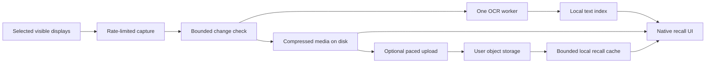

# Omarchy recall: performance recommendation and feasibility plan

Date: 2026-09-18. Status: research and proposed test plan. No recorder, benchmark, upload, or system configuration change was run for this review.

Subsequent work: the user authorized a bounded prototype after this research. See the [measured results](feasibility-results.md) for completed checks and unmet targets; this document preserves the original proposal and broader acceptance gates.

Companion to the [living exploration](omarchy-agent-exploration.md) and [interaction proposal](omarchy-recall-interaction.md).

## Primary requirement

The user wants recall to sip RAM, disk, and CPU while they work. Foreground responsiveness is a release criterion, alongside resource consumption and useful recall. Low process CPU alone is insufficient: capture can add work to the compositor/GPU, and encoding, database maintenance, or uploads can interfere with other work.

Core scope remains captured visible screens, searchable text, and a timeline. Automatic project/conversation association, continuous language-model inference, audio, and hidden application activity are not required.

## Recommendation

Use a small native service with a sparse, explicitly scheduled capture path; one bounded OCR worker; compressed media on disk; and a local text index. Keep the native UI and user-requested queries responsive independently of background OCR, encoding, maintenance, and uploads. Start without embeddings or periodic model summaries.

Compare a simple snapshot baseline with a persistent native capture client before choosing the production path. Compare independent compressed images with short hardware-encoded segments on the same retained frames. Pick based on total resource cost and foreground impact at an acceptable recall quality, not codec reputation or process CPU in isolation.

The follow-up [Rewind and open-source compression research](omarchy-recall-compression-research.md) makes short compressed video segments the leading storage candidate to test, with independent images retained as the comparison. It also identifies temporary image/raw-frame writes that final archive size would conceal. This changes the order of investigation, not the requirement for measured codec, memory, seeking, and foreground results.

Each arrow has an explicit ownership/lifetime and a bounded queue. No stage waits synchronously for a model or network service. When the next stage cannot keep up, the service reduces work; it does not accumulate raw images indefinitely.

## What was verified

Read-only inspection of the development machine on 2026-09-18 found Hyprland 0.56.2, PipeWire 1.6.8, portal-hyprland 1.4.1, Tesseract 5.5.3, FFmpeg 9.0.1, SQLite 3.53.4, and systemd 261.2. The host reports a Ryzen 7 9800X3D, about 60 GiB usable RAM, AMD discrete/integrated graphics, and SSD storage. This is a powerful development machine; a smaller-memory machine must also be represented before generalizing results.

The three enabled displays are two 3840×2160 outputs and one 2560×720 output, with mixed rotation/scaling. No screen pixels were captured. FFmpeg lists hardware encoders, but successful negotiation, driver behavior, energy use, and practical codec support were not tested.

### Capturing is not free, even with a modern protocol

Hyprland 0.56.2 registers ext-image-copy and wlr-screencopy. Its inspected capture source currently treats the image as fully damaged; the ext path also reports full-buffer damage. SHM capture renders and reads pixels into CPU memory. DMA-BUF still renders into a client buffer. Pending capture frames block direct scanout. These are source findings, not measured regressions. [Registration](https://github.com/hyprwm/Hyprland/blob/v0.56.2/src/managers/ProtocolManager.cpp#L229-L232), [damage](https://github.com/hyprwm/Hyprland/blob/v0.56.2/src/managers/screenshare/ScreenshareFrame.cpp#L123-L140), [ext damage](https://github.com/hyprwm/Hyprland/blob/v0.56.2/src/protocols/ImageCopyCapture.cpp#L418-L423), [copy paths](https://github.com/hyprwm/Hyprland/blob/v0.56.2/src/managers/screenshare/ScreenshareFrame.cpp#L393-L474), [scanout](https://github.com/hyprwm/Hyprland/blob/v0.56.2/src/managers/screenshare/ScreenshareSession.cpp#L170-L177).

Consequences for this design: use few capture requests; do not assume damage notifications provide cheap small-region updates, or that DMA-BUF implies zero-copy OCR. Comparing images after capture saves subsequent processing, not the copy already performed. Measure the whole desktop.

### Buffer size is a first-order constraint

Calculated from dimensions at four bytes per pixel, excluding padding, extra surfaces, models, and the UI:

| Display set | One raw frame per display | Three such sets |
| --- | ---: | ---: |
| One 1920×1080 display | 7.91 MiB | 23.73 MiB |
| One 3840×2160 display | 31.64 MiB | 94.92 MiB |
| Current three displays | 70.31 MiB | 210.94 MiB |

A queue described only as “a few frames” is insufficient. Budget bytes across capture buffers, previous-frame comparisons, OCR input copies, encoder surfaces, previews, and in-flight transfers. GPU allocations must also be measured. Reuse buffers, stagger display captures, and release ownership promptly. Each display keeps its actual capture timestamp; staggered captures are not a simultaneous desktop snapshot.

## Pipeline decisions

### Capture: sparse requests, explicit coverage

For the baseline, request monitor snapshots directly from grim into memory using an uncompressed output path. It provides a simple cost reference, not the proposed permanent process-per-frame implementation. The installed Omarchy capture wrappers are interactive tools: they freeze/select regions, touch the clipboard, or notify. Do not repurpose that workflow as a background recorder.

The production candidate is a persistent ext-image-copy client with reusable buffers and at most one in-flight request in its initial implementation. Keep the connection available without perpetually leaving a capture request pending. Compare its memory and scanout behavior with the sparse baseline.

Portal/PipeWire remains a portability candidate. Verify that the requested low rate reduces upstream capture work: dropping most frames after a high-rate stream has already captured them is not the intended optimization. The reviewed Hyprland portal uses wlr screencopy and adopts the negotiated maximum frame rate. [Portal implementation](https://github.com/hyprwm/xdg-desktop-portal-hyprland/blob/v1.4.1/src/portals/Screencopy.cpp#L504), [frame rate](https://github.com/hyprwm/xdg-desktop-portal-hyprland/blob/v1.4.1/src/portals/Screencopy.cpp#L796-L798).

The user confirmed adjustable capture rate on 2026-09-18. Present the normal interval in understandable terms such as "one capture every 2 seconds," with its coverage/resource tradeoff. Proposed overload protection may temporarily slow or pause capture; show that state and return to the configured interval when pressure clears. Do not imply a guaranteed cadence during overload.

Test sampling intervals of 0.5, 1, 2, and 5 seconds; these are experiment inputs, not selected defaults or the complete settings range. Avoid chasing display refresh rate. Coalesce window/workspace changes as possible sampling hints, not independent content records. A small settling delay may help scrolling, but cannot be the only trigger: continuous scrolling must still receive bounded samples. All selected displays receive service; prioritizing the focused display must not silently starve others.

Suppress cursor-only changes where the capture path permits, pause on lock/suspend, and respect exclusions before saving data. Capture visible monitor composition; capturing an individual window can expose obscured content and is not interchangeable. Test blank/unchanged scenes, clock/caret changes, video, mixed scale/rotation, and resume/hotplug. A damage signal or tiny-thumbnail comparison alone cannot guarantee preservation of a small changed digit.

### OCR: one reusable engine, one job at a time

Use Tesseract as the first measured candidate because it is already present. Its API allows retaining loaded models while clearing per-image state, and region recognition through `SetRectangle`. Raw `SetImage` copies pixels, which must be budgeted. Start with only the selected language data, compare the fast model for accuracy, and verify the build's thread behavior; test a one-thread limit where supported. [API](https://raw.githubusercontent.com/tesseract-ocr/tesseract/main/include/tesseract/baseapi.h), [models](https://tesseract-ocr.github.io/tessdoc/Data-Files.html), [thread guidance](https://github.com/tesseract-ocr/tessdoc/blob/main/FAQ.md).

Keep the engine warm while work is arriving; consider unloading after sustained inactivity or memory pressure. Repeated startup saves idle RAM at the cost of initialization, so measure this policy rather than repeatedly starting an OCR process for every frame.

First establish a whole-frame OCR baseline on retained changed images. Exact duplicate pixels can reuse results. If OCR dominates, add changed-region recognition with padding, correct coordinate mapping, and removal of stale text. Scrolling, resolution changes, and layout shifts require broader invalidation. Do not downscale small text or use perceptual similarity aggressively just to pass the CPU target. [Recognition-quality guidance](https://tesseract-ocr.github.io/tessdoc/ImproveQuality.html).

Queue identifiers for compressed media, not raw frame arrays. Limit queued count/age and processing rate. Prioritize an explicitly opened moment, then recent pending work, with a bounded catch-up allowance. If arrival persistently exceeds processing, reduce admission/capture rate and expose incomplete indexing. The plan must not depend on an unlimited overnight catch-up session. Retained but unindexed images remain browsable; search coverage must say when indexing is incomplete.

### Media: compare two families at equivalent usefulness

| Candidate | What to measure |
| --- | --- |
| Independent compressed images | Fast lossless versus conservative lossy settings; text readability, CPU per retained image, bytes, direct seek, file-count overhead, and deletion. |
| Short hardware-encoded segments | Cross-frame savings against GPU/CPU copies, conversion, encoder buffers, energy, decoding, seek, and selective deletion. |

Use actual capture timestamps independent of playback timing. Video segments need usable random-access boundaries; FFmpeg documents the relationship between segment cuts and keyframes. Keep advanced buffering/lookahead out of the initial low-latency candidate. This is a comparison, not a claim that video or hardware encoding will win. [FFmpeg segmenter](https://ffmpeg.org/ffmpeg-formats.html#segment_002c-stream_005fsegment_002c-ssegment).

Because the capture rate is adjustable, bound real-time segment span as well as frame count/bytes. A fixed frame-count limit alone can represent very different stretches of history at different rates. Compare keyframe spacing against measured seek latency and remote transfer volume.

Do not encode a heavy intermediate image, decode it for OCR, and re-encode it again by default. Share the captured input with bounded consumers where practical; retain compressed media only after duplicate rejection. Create small representative previews. Routine maintenance should not recompress yesterday's entire archive while the user works.

Disk planning must use retained change rate, not merely the configured interval. For illustration only: at an assumed 250 KiB per retained image, one image every two seconds for eight hours is 3.43 GiB per display, or 10.30 GiB for three. These are arithmetic examples, not observed file sizes. Avoiding redundant captures is essential even when individual images seem small.

### Index: local, incremental, bounded

SQLite with FTS5 is the first candidate for local text search. Keep media outside the database; reference it by observation/time. Preserve exact OCR strings, app/time fields where available, and text regions for highlighting. An exact duplicate still needs an observation/time reference if it reappears; deduplication must not collapse separate visits into one false occurrence.

Use short batched writes and short-lived reads. Bound page caches and query results; avoid decoding all thumbnails or loading the complete archive in memory. Test punctuation and identifiers so invoice numbers, error strings, and paths remain findable. Semantic search is a later optional enhancement.

FTS merges and WAL checkpoints can add intermittent work. Schedule small maintenance batches with explicit debt/WAL limits; do not merely disable maintenance. Do not run full-index optimization or whole-database vacuum on every capture. Retention cleanup should proceed in bounded batches. [FTS5 merge behavior](https://www.sqlite.org/fts5.html#the_automerge_configuration_option), [WAL checkpoints](https://www.sqlite.org/wal.html#checkpointing).

Keep a documented crash-loss window for batched work and retain/reconcile completed media after interruption. Do not disable durability indiscriminately to improve a benchmark.

### Optional remote storage: transfer work has a budget too

Keep search data and representative previews local. Start with one paced upload and one user-requested download, a small prefetch window, bounded streaming buffers, and retry backoff. User-requested retrieval takes precedence over archival uploads. Don't load a whole large object into RAM to checksum, encrypt, or upload it. Confirm the completed remote copy and persist its catalog state before local eviction.

Count media, index, previews, pending uploads, download cache, temporary files, journals, and logs against disk allowances. Cache eviction preserves remote history; expiration removes it according to retention policy. If the remote is unavailable, apply backpressure before filling the disk. Don't add a CDN or shared hosted backend to solve a single-user cache problem.

## Protect foreground work

Proposed order under pressure: stop optional synthesis/prefetch; pause uploads and maintenance; reduce OCR work; lower capture frequency if necessary; pause capture when the safe resource envelope cannot be maintained. Report indexing lag or capture gaps. Sampling and overload behavior cannot promise to remember every fleeting event at arbitrarily low cost.

Use a background systemd user service with low relative CPU/I/O priority and separately controllable expensive workers. Test CPU quotas for workers as backstops; they are ceilings, not priority guarantees, and must not block the UI. Memory high-water controls can throttle/reclaim; a hard maximum is a last defense. Verify actual controller delegation, hierarchy, and I/O behavior. [systemd resource controls](https://github.com/systemd/systemd/blob/v261.2/man/systemd.resource-control.xml).

Have the application release caches/stop admission before memory limits cause reclaim thrashing. Linux pressure-stall information provides CPU, memory, and I/O contention signals, including threshold notifications; use this alongside queue/resource measurements instead of frequent broad process scans. It does not measure GPU contention, so keep static capture/encoder budgets and GPU impact checks. [Kernel PSI documentation](https://docs.kernel.org/accounting/psi.html).

These controls cannot bound all compositor work caused by capture. Foreground frame timing and energy measurements remain mandatory. Include logs and metrics in the budget: counters and bounded/rotated diagnostics, not per-frame verbose logs forever.

## Proposed performance gates

These are initial engineering targets, not measured capabilities or user-approved defaults. Report missed targets rather than silently relaxing them or discarding difficult content.

| Area | Initial target / required report |
| --- | --- |
| Static-screen CPU | Aim below 0.5% of one logical CPU averaged over ten minutes after settling. Include capture-related compositor work separately. |
| Ordinary-work CPU | Aim below 5% of one logical CPU on the one-1080p fixture; report CPU-seconds/hour and scaling on the actual three-display setup. Do not normalize away cost across eight CPUs. |
| CPU memory | Aim for at most 150 MiB steady background PSS for one 1080p display, and 256 MiB for the current display set. Measure peaks and cgroup charged memory too; separately account GPU buffers and UI-open memory. Set safe hard limits only after allocation profiling. |
| Foreground impact | No repeatable regression above 5% in paired foreground throughput/p95–p99 latency runs; report absolute times, frame misses, and measurement noise. Any visible stutter requires investigation even if an average passes. |
| Search / local seek | Provisional p95 goals: under 200 ms for indexed local results and under 300 ms to display cached full media on the declared test corpus/hardware. |
| Storage | Report bytes retained and total device bytes written per active hour; target near-zero media growth on an unchanged desktop. No universal GiB/day claim before workloads and quality are measured. |
| Coverage | Measure displayed-token capture rate separately from OCR correctness. Encoding/dedup optimizations must not lose the deliberately retained small-text changes relative to the same sampling baseline. |
| Long-running health | After a full workday, no growing raw queue, stuck uploads, runaway WAL/logs, or monotonic memory leak. |

The numerical budgets may prove unattainable for a candidate, especially across high-resolution displays. That is useful evidence to change the pipeline or offer an explicit coverage/resource tradeoff. A hidden quality reduction is not a performance success.

## Bounded feasibility test plan

1. **Build a controlled fixture.** Public/synthetic screens: static reading, typing and one-character edits, terminal output, scrolling, app switches, small colored text, light/dark themes, and animated content. Include tokens visible for 0.25, 0.5, 1, 2, and 5 seconds. Keep expected text/times as test ground truth.
2. **Isolate capture overhead.** Compare no recorder, sparse direct snapshots, and persistent capture at the four proposed intervals. Start with one display, then the actual mixed-scale/rotation setup. Inspect compositor CPU, frame timing, GPU activity/energy, memory copies, and direct scanout effects.
3. **Add one stage at a time.** Change detection, media encode, OCR, and indexing. Measure each increment before combining them. Compare the two media families at equivalent readable quality and retained frames. Test selected-language OCR with bounded threads and warm/cold initialization.
4. **Measure the full user path.** Display a known string, leave it, search it, open its exact moment, step to neighboring captures, and return using the keyboard. Measure capture-to-searchable delay, result latency, and warm/cold seek latency. Use controlled older indexes to test retained-history scale; label synthesized corpora as such.
5. **Repeat with competing work.** Paired runs with/without recall during a build, browser interaction, and video/fullscreen graphics workload. Run both orders, repeat, and report variance. Collect process-tree PSS/RSS, cgroup memory/I/O, compositor/GPU deltas, CPU-seconds, power where available, and foreground task outcomes.
6. **Exercise limits.** Constrained RAM/CPU test machine or explicitly limited worker budgets, slow/offline storage, disk watermark, OCR backlog, lock/resume, display changes, interrupted uploads, and restart. Validate bounded degradation and exclusions as well as speed. Long-running tests need explicit scheduling; none were launched in this research pass.
7. **Add remote recall last.** Use a dedicated test destination when one is authorized. Upload and verify a test segment, evict its local full copy, search locally, load remotely, cache it, then seek nearby. Measure first-byte/full-display latency and transfer volume. Confirm retention removes test data and retry queues cannot resurrect deleted history.

The result should select one capture path, one media format/profile, a sampling/overload policy, and measured budgets. A small proof is the next implementation step; the current deliverable is this evidence-based recommendation and test plan.
